# 需求分析文档图表绘图 Prompt 与 PlantUML 代码

说明：本文档按 `requirements.tex` 中的占位图片名称组织。能直接使用 PlantUML 绘制的图均给出 PlantUML 代码；如后续使用图形工具手绘，可将对应图名和代码中的节点关系作为绘图 prompt。

## 1. 软件总体流程图

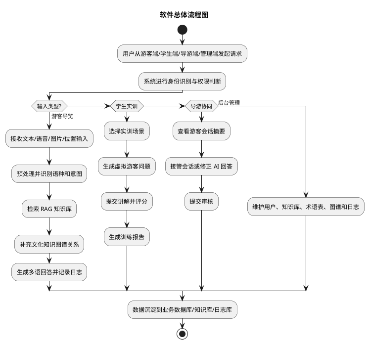

## 2. 游客用例图

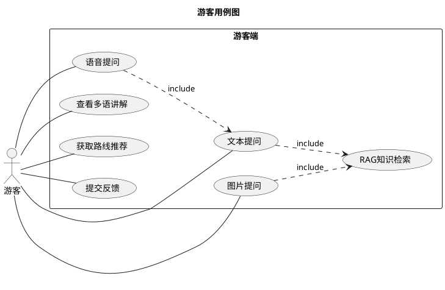

## 3. 游客文本提问顺序图

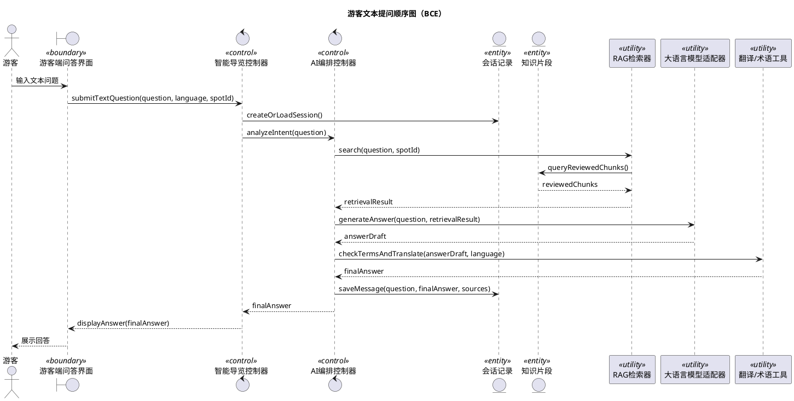
## 4. 游客语音提问顺序图

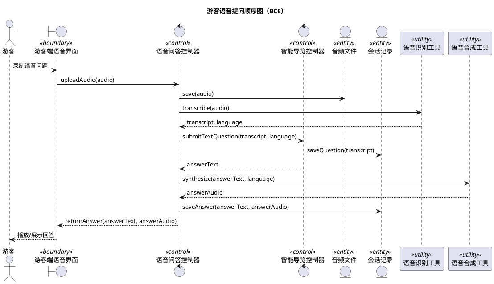
## 5. 游客图片提问顺序图

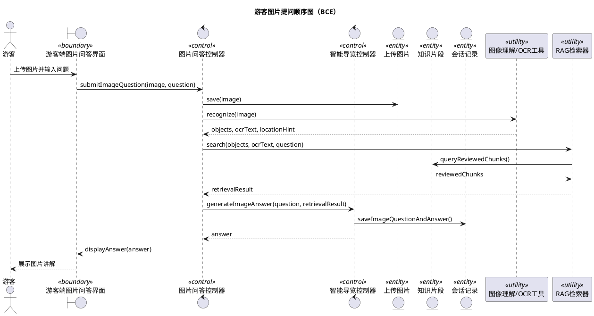
## 6. 游客查看多语讲解顺序图

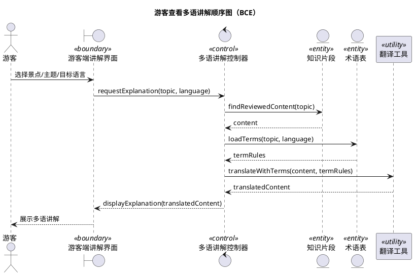
## 7. 游客获取路线推荐顺序图

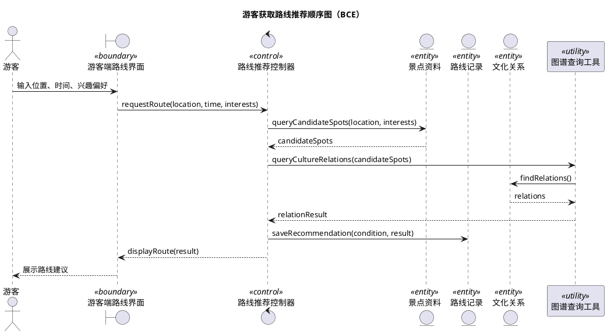
## 8. 游客提交反馈顺序图

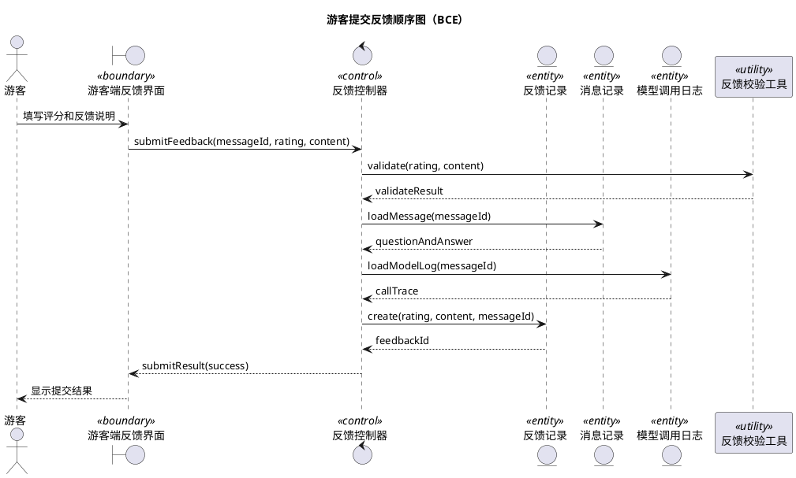
## 9. 学生用例图

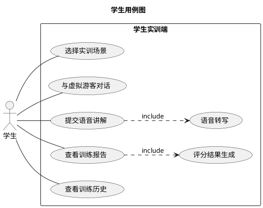

## 10. 学生选择实训场景顺序图

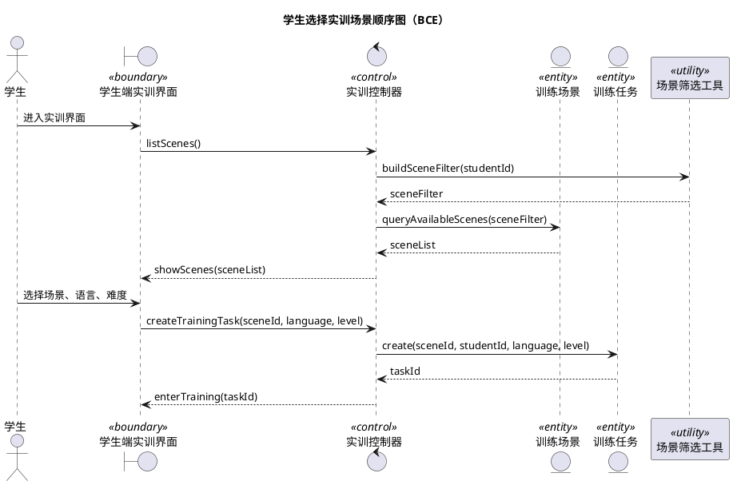
## 11. 学生与虚拟游客对话顺序图

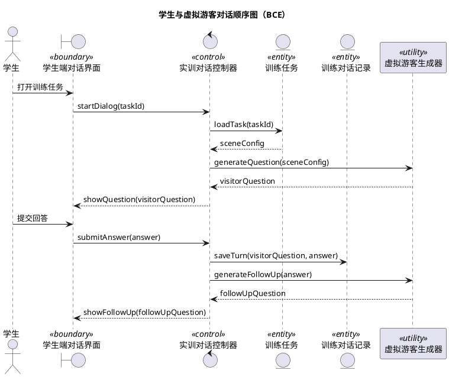
## 12. 学生提交语音讲解顺序图

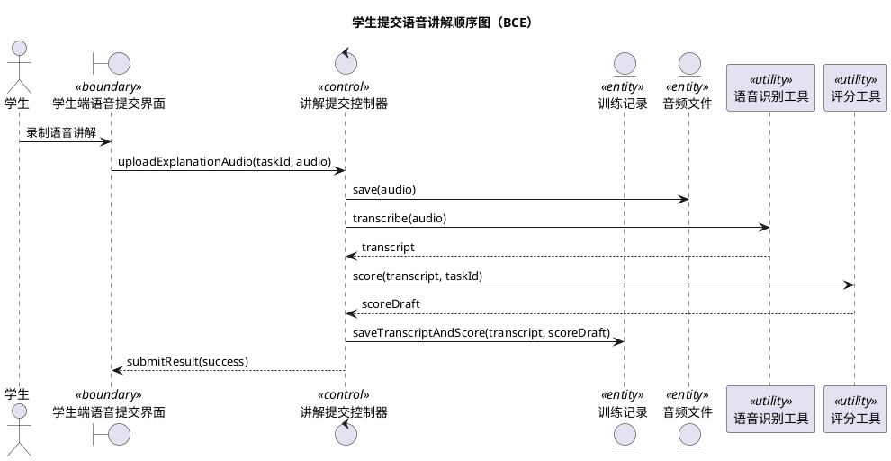
## 13. 学生查看训练报告顺序图

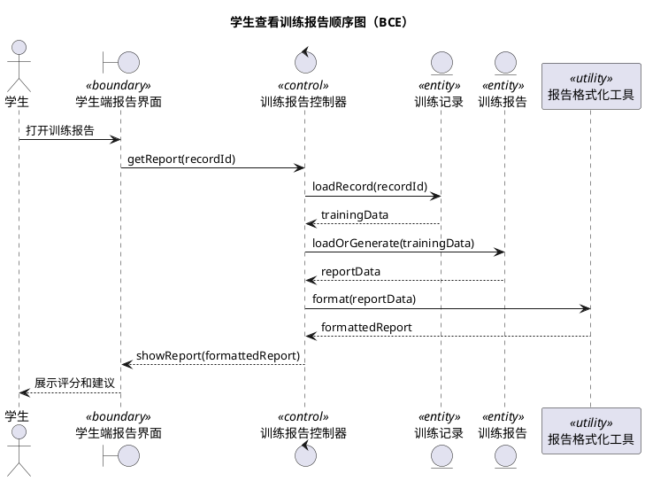
## 14. 学生查看训练历史顺序图

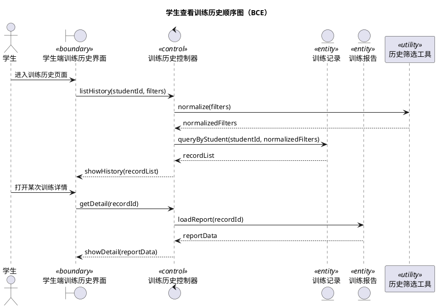
## 15. 导游用例图

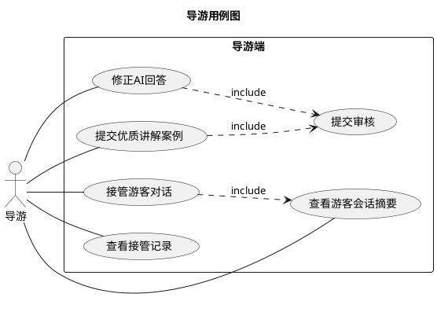

## 16. 导游查看游客会话摘要顺序图

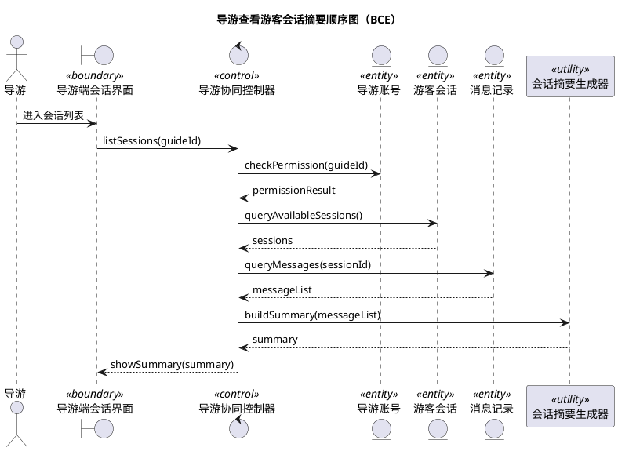
## 17. 导游接管游客对话顺序图

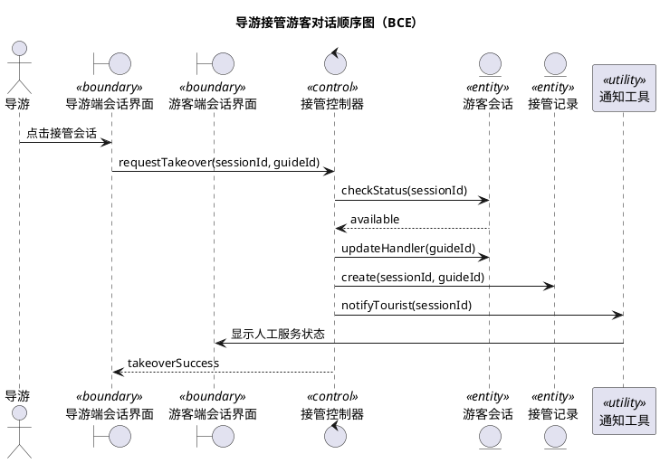
## 18. 导游修正 AI 回答顺序图

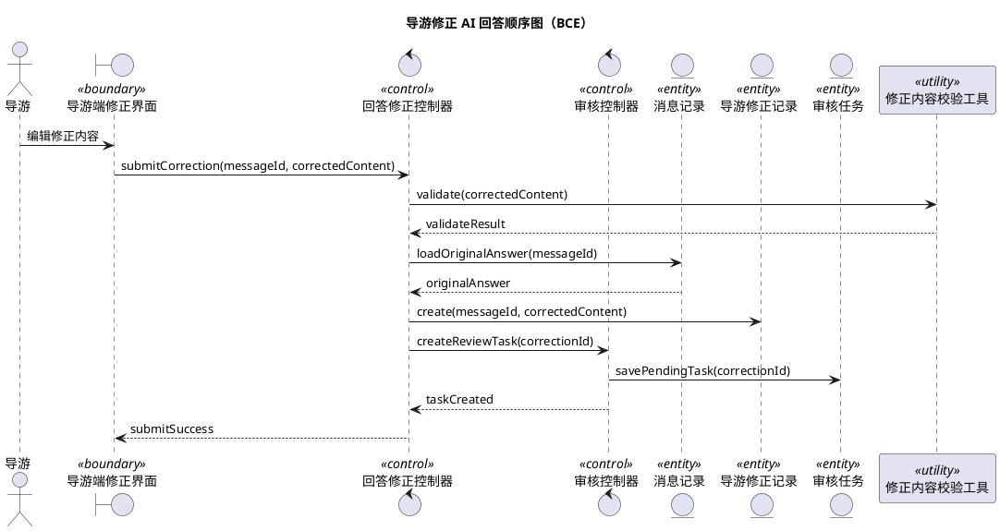
## 19. 导游提交优质讲解案例顺序图

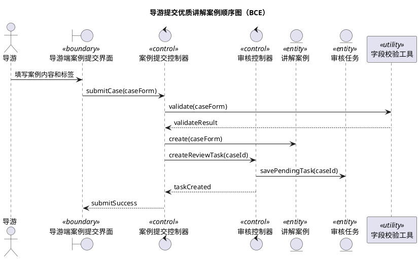
## 20. 导游查看接管记录顺序图

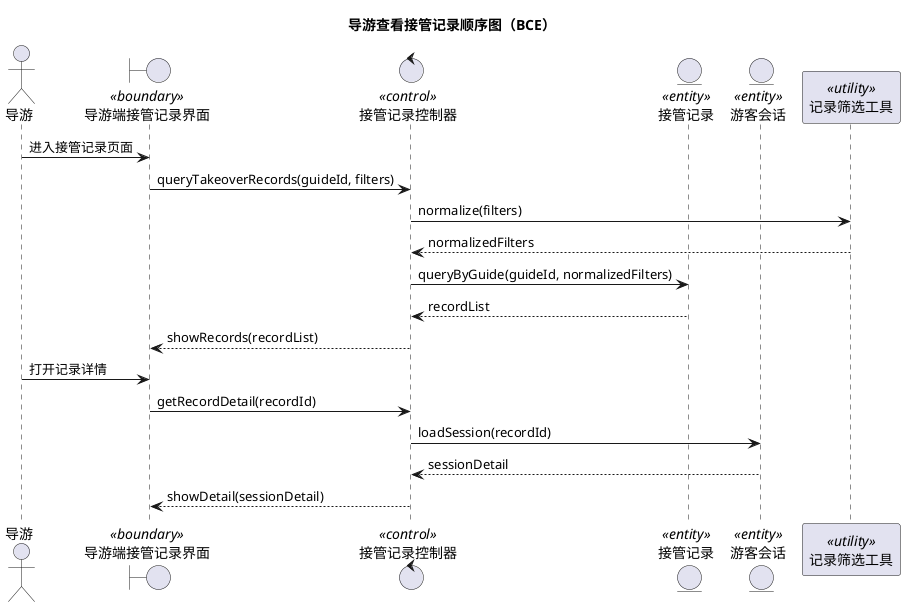
## 21. 管理员用例图

```plantuml
@startuml
title 管理员用例图
left to right direction
actor 管理员
rectangle "管理端" {
  管理员 -- (管理用户与权限)
  管理员 -- (上传知识文档)
  管理员 -- (审核知识内容)
  管理员 -- (维护术语表)
  管理员 -- (维护知识图谱)
  管理员 -- (查看模型调用日志)
  管理员 -- (管理用户反馈)
  (上传知识文档) ..> (审核知识内容) : include
  (管理用户反馈) ..> (审核知识内容) : extend
}
@enduml
```

## 22. 管理员管理用户与权限顺序图

```plantuml
@startuml
title 管理员管理用户与权限顺序图（BCE）
actor 管理员
boundary "管理端用户界面" as UI <<boundary>>
control "用户权限控制器" as UserCtl <<control>>
entity "用户账号" as User <<entity>>
entity "角色权限" as Role <<entity>>
participant "权限校验工具" as Auth <<utility>>

管理员 -> UI : 进入用户管理界面
UI -> UserCtl : queryUsers(filters)
UserCtl -> Auth : checkAdminPermission(adminId)
Auth --> UserCtl : allowed
UserCtl -> User : query(filters)
User --> UserCtl : userList
UserCtl --> UI : showUsers(userList)
管理员 -> UI : 新增/修改/停用/调整角色
UI -> UserCtl : saveUserChange(changeForm)
UserCtl -> Role : validateRole(changeForm.role)
Role --> UserCtl : roleValid
UserCtl -> User : save(changeForm)
UserCtl --> UI : saveResult(success)
@enduml
```
## 23. 管理员上传知识文档顺序图

```plantuml
@startuml
title 管理员上传知识文档顺序图（BCE）
actor 管理员
boundary "管理端知识上传界面" as UI <<boundary>>
control "知识入库控制器" as KnowledgeCtl <<control>>
control "审核控制器" as ReviewCtl <<control>>
entity "知识文档" as Doc <<entity>>
entity "知识切片" as Chunk <<entity>>
entity "审核任务" as ReviewTask <<entity>>
participant "文档解析工具" as Parser <<utility>>

管理员 -> UI : 上传文档并填写元数据
UI -> KnowledgeCtl : uploadDocument(file, metadata)
KnowledgeCtl -> Parser : parseAndClean(file)
Parser --> KnowledgeCtl : cleanText
KnowledgeCtl -> Doc : create(metadata)
KnowledgeCtl -> Chunk : splitAndSave(cleanText, docId)
KnowledgeCtl -> ReviewCtl : createReviewTasks(chunkIds)
ReviewCtl -> ReviewTask : savePendingTasks(chunkIds)
ReviewCtl --> KnowledgeCtl : tasksCreated
KnowledgeCtl --> UI : uploadSuccess
@enduml
```
## 24. 管理员审核知识内容顺序图

```plantuml
@startuml
title 管理员审核知识内容顺序图（BCE）
actor 管理员
boundary "管理端审核界面" as UI <<boundary>>
control "审核控制器" as ReviewCtl <<control>>
control "知识库控制器" as KnowledgeCtl <<control>>
entity "审核任务" as ReviewTask <<entity>>
entity "知识切片" as Chunk <<entity>>
participant "向量化工具" as Embedder <<utility>>

管理员 -> UI : 打开审核任务列表
UI -> ReviewCtl : listPendingTasks(filters)
ReviewCtl -> ReviewTask : queryPending(filters)
ReviewTask --> ReviewCtl : taskList
ReviewCtl --> UI : showTasks(taskList)
管理员 -> UI : 提交通过/退回/下线结果
UI -> ReviewCtl : submitReview(taskId, decision)
ReviewCtl -> ReviewTask : updateStatus(decision)
ReviewCtl -> Chunk : updateReviewStatus(decision)
alt 审核通过
  ReviewCtl -> Embedder : vectorize(chunkContent)
  Embedder --> ReviewCtl : vectorId
  ReviewCtl -> KnowledgeCtl : publishChunk(chunkId, vectorId)
end
ReviewCtl --> UI : reviewResult(success)
@enduml
```
## 25. 管理员维护术语表顺序图

```plantuml
@startuml
title 管理员维护术语表顺序图（BCE）
actor 管理员
boundary "管理端术语表界面" as UI <<boundary>>
control "术语控制器" as TermCtl <<control>>
entity "术语" as Term <<entity>>
participant "术语校验工具" as Validator <<utility>>

管理员 -> UI : 查询或新增术语
UI -> TermCtl : queryTerms(keyword)
TermCtl -> Term : query(keyword)
Term --> TermCtl : termList
TermCtl --> UI : showTerms(termList)
管理员 -> UI : 填写术语信息
UI -> TermCtl : saveTerm(termForm)
TermCtl -> Validator : validateUniqueAndRequired(termForm)
Validator --> TermCtl : validateResult
TermCtl -> Term : saveVersion(termForm)
TermCtl --> UI : saveResult(success)
@enduml
```
## 26. 管理员维护知识图谱顺序图

```plantuml
@startuml
title 管理员维护知识图谱顺序图（BCE）
actor 管理员
boundary "管理端图谱界面" as UI <<boundary>>
control "图谱控制器" as GraphCtl <<control>>
entity "文化实体" as Entity <<entity>>
entity "文化关系" as Relation <<entity>>
participant "图谱校验工具" as Validator <<utility>>

管理员 -> UI : 查询实体和关系
UI -> GraphCtl : queryGraph(filters)
GraphCtl -> Entity : queryEntities(filters)
GraphCtl -> Relation : queryRelations(filters)
Entity --> GraphCtl : entities
Relation --> GraphCtl : relations
GraphCtl --> UI : showGraph(entities, relations)
管理员 -> UI : 新增/修改实体或关系
UI -> GraphCtl : saveGraphChange(changeForm)
GraphCtl -> Validator : validateGraphChange(changeForm)
Validator --> GraphCtl : validateResult
GraphCtl -> Entity : saveEntityIfNeeded(changeForm)
GraphCtl -> Relation : saveRelationIfNeeded(changeForm)
GraphCtl --> UI : saveResult(success)
@enduml
```
## 27. 管理员查看模型调用日志顺序图

```plantuml
@startuml
title 管理员查看模型调用日志顺序图（BCE）
actor 管理员
boundary "管理端日志界面" as UI <<boundary>>
control "日志查询控制器" as LogCtl <<control>>
entity "模型调用日志" as Log <<entity>>
entity "消息记录" as Message <<entity>>
participant "日志脱敏工具" as Masker <<utility>>

管理员 -> UI : 输入筛选条件
UI -> LogCtl : queryLogs(filters)
LogCtl -> Log : query(filters)
Log --> LogCtl : logList
LogCtl -> Masker : maskSensitiveFields(logList)
Masker --> LogCtl : safeLogList
LogCtl --> UI : showLogs(safeLogList)
管理员 -> UI : 查看日志详情
UI -> LogCtl : getLogDetail(logId)
LogCtl -> Log : loadDetail(logId)
LogCtl -> Message : loadRelatedMessage(messageId)
Message --> LogCtl : messageDetail
Log --> LogCtl : logDetail
LogCtl --> UI : showLogDetail(logDetail, messageDetail)
@enduml
```
## 28. 管理员管理用户反馈顺序图

```plantuml
@startuml
title 管理员管理用户反馈顺序图（BCE）
actor 管理员
boundary "管理端反馈界面" as UI <<boundary>>
control "反馈处理控制器" as FeedbackCtl <<control>>
control "知识修订控制器" as RevisionCtl <<control>>
entity "反馈记录" as Feedback <<entity>>
entity "消息记录" as Message <<entity>>
entity "知识修订任务" as Revision <<entity>>
participant "反馈分类工具" as Classifier <<utility>>

管理员 -> UI : 浏览反馈列表
UI -> FeedbackCtl : queryFeedback(filters)
FeedbackCtl -> Feedback : query(filters)
Feedback --> FeedbackCtl : feedbackList
FeedbackCtl --> UI : showFeedback(feedbackList)
管理员 -> UI : 打开反馈详情并处理
UI -> FeedbackCtl : handleFeedback(feedbackId, decision)
FeedbackCtl -> Message : loadRelatedMessage(messageId)
Message --> FeedbackCtl : questionAndAnswer
FeedbackCtl -> Classifier : classify(feedback, questionAndAnswer)
Classifier --> FeedbackCtl : feedbackType
alt 需要知识修订
  FeedbackCtl -> RevisionCtl : createRevisionTask(feedbackId)
  RevisionCtl -> Revision : saveTask(feedbackId)
end
FeedbackCtl -> Feedback : updateStatus(decision)
FeedbackCtl --> UI : handleResult(success)
@enduml
```
## 29. 系统 ER 图

说明：该图按课程 ER 图要求绘制，实体之间使用直线连接；强依赖/组成关系使用实心菱形 `*--`，弱依赖/引用关系使用空心菱形 `o--`，并在关系两端标注 `1` / `*`。

```plantuml
@startuml
title 系统 ER 图（菱形联系与 1/* 标注）
skinparam classAttributeIconSize 0
hide methods

class "用户 User" as User {
  user_id : PK
  name
  role
  language_preference
  status
}

class "导览会话 Session" as Session {
  session_id : PK
  user_id : FK
  scene
  language
  created_at
}

class "消息 Message" as Message {
  message_id : PK
  session_id : FK
  input_type
  content
  answer
  created_at
}

class "模型调用日志 ModelCallLog" as Log {
  log_id : PK
  message_id : FK
  model_name
  retrieved_chunks
  status
}

class "反馈 Feedback" as Feedback {
  feedback_id : PK
  message_id : FK
  rating
  content
  status
}

class "知识文档 KnowledgeDocument" as Doc {
  document_id : PK
  title
  source
  version
  upload_time
}

class "知识切片 KnowledgeChunk" as Chunk {
  chunk_id : PK
  document_id : FK
  content
  review_status
  sensitivity_level
}

class "向量索引 VectorIndex" as Vector {
  vector_id : PK
  chunk_id : FK
  embedding_model
  index_status
}

class "术语 Term" as Term {
  term_id : PK
  zh_name
  target_name
  language
  description
}

class "文化实体 CultureEntity" as CultureEntity {
  entity_id : PK
  name
  entity_type
  description
}

class "文化关系 CultureRelation" as CultureRelation {
  relation_id : PK
  source_id : FK
  target_id : FK
  relation_type
}

class "训练场景 TrainingScene" as Scene {
  scene_id : PK
  scene_name
  scene_type
  difficulty
}

class "训练记录 TrainingRecord" as TrainRecord {
  record_id : PK
  student_id : FK
  scene_id : FK
  transcript
  score
}

class "训练报告 TrainingReport" as TrainReport {
  report_id : PK
  record_id : FK
  total_score
  suggestion
}

class "导游修正 GuideCorrection" as Correction {
  correction_id : PK
  guide_id : FK
  message_id : FK
  corrected_content
  review_status
}

class "审核任务 ReviewTask" as ReviewTask {
  task_id : PK
  target_type
  target_id
  review_status
}

User "1" *-- "*" Session : 创建
Session "1" *-- "*" Message : 包含
Message "1" *-- "*" Log : 产生
Message "1" o-- "*" Feedback : 被反馈

Doc "1" *-- "*" Chunk : 切分
Chunk "1" *-- "1" Vector : 向量化
Chunk "*" o-- "*" Term : 使用术语
Chunk "1" o-- "*" ReviewTask : 被审核

CultureEntity "1" o-- "*" CultureRelation : 源实体
CultureEntity "1" o-- "*" CultureRelation : 目标实体

Scene "1" o-- "*" TrainRecord : 被使用
User "1" o-- "*" TrainRecord : 学生训练
TrainRecord "1" *-- "1" TrainReport : 生成

User "1" o-- "*" Correction : 导游提交
Message "1" o-- "*" Correction : 被修正
Correction "1" o-- "*" ReviewTask : 进入审核
Feedback "1" o-- "*" ReviewTask : 触发修订
@enduml
```

## 30. UML 类图

```plantuml
@startuml
title UML 类图
class User {
  userId
  name
  role
  languagePreference
  status
}
class Session {
  sessionId
  userId
  scene
  language
  createdAt
}
class Message {
  messageId
  sessionId
  inputType
  content
  answer
}
class KnowledgeDocument {
  documentId
  title
  source
  version
}
class KnowledgeChunk {
  chunkId
  documentId
  content
  reviewStatus
}
class TrainingRecord {
  recordId
  studentId
  sceneId
  transcript
  score
}
class GuideCorrection {
  correctionId
  guideId
  messageId
  correctedContent
  reviewStatus
}
class ModelCallLog {
  logId
  requestId
  modelName
  status
}
User "1" -- "*" Session
Session "1" -- "*" Message
KnowledgeDocument "1" -- "*" KnowledgeChunk
User "1" -- "*" TrainingRecord
User "1" -- "*" GuideCorrection
Message "1" -- "*" ModelCallLog
Message "1" -- "*" GuideCorrection
@enduml
```

## 31. 用户与权限管理流程图

```plantuml
@startuml
title 用户与权限管理流程图
start
:用户访问系统;
if (是否需要登录?) then (是)
  :提交账号信息;
  if (认证通过?) then (是)
    :识别用户角色;
    :加载对应功能菜单;
  else (否)
    :提示登录失败;
    stop
  endif
else (否)
  :进入游客端基础功能;
endif
stop
@enduml
```

## 32. 智能导览流程图

```plantuml
@startuml
title 智能导览流程图
start
:游客提交问题;
:识别输入类型;
:语音/图片/文本预处理;
:识别语种和意图;
:RAG 检索知识库;
if (是否有可信知识?) then (是)
  :组装提示词并生成回答;
  :术语检查与翻译;
  :返回文本或语音结果;
else (否)
  :提示暂无可靠资料;
endif
:记录日志;
stop
@enduml
```

## 33. 图片识别问答流程图

```plantuml
@startuml
title 图片识别问答流程图
start
:游客上传图片;
:图像理解与 OCR;
:提取对象、文字和地点线索;
:生成检索关键词;
:检索知识库和图谱;
if (检索到可信内容?) then (是)
  :生成图片相关讲解;
else (否)
  :提示暂无可靠讲解资料;
endif
:返回结果并保存记录;
stop
@enduml
```

## 34. 知识库管理流程图

```plantuml
@startuml
title 知识库管理流程图
start
:管理员上传资料;
:文档解析与清洗;
:知识切片与元数据标注;
:创建审核任务;
if (审核通过?) then (是)
  :向量化入库;
  :更新知识库版本;
else (否)
  :退回修改或下线;
endif
stop
@enduml
```

## 35. AI 导游实训流程图

```plantuml
@startuml
title AI 导游实训流程图
start
:学生选择实训场景;
:系统生成虚拟游客问题;
:学生提交语音讲解;
:语音转写;
:与知识库标准内容比对;
:按评分维度计算结果;
:生成训练报告;
:保存训练记录;
stop
@enduml
```

## 36. 真人导游协同流程图

```plantuml
@startuml
title 真人导游协同流程图
start
:游客与 AI 对话;
:系统生成会话摘要;
:导游查看摘要;
if (是否需要接管?) then (是)
  :导游接管会话;
  :导游修正或补充回答;
  :提交审核;
  :审核通过后进入知识库或案例库;
else (否)
  :继续 AI 服务;
endif
stop
@enduml
```

## 37. 反馈与日志处理流程图

```plantuml
@startuml
title 反馈与日志处理流程图
start
:用户提交反馈或系统产生异常;
:日志服务记录请求信息;
:管理员查看反馈;
if (是否需要修订知识?) then (是)
  :创建知识修订任务;
  :审核后更新知识库;
else (否)
  :归档反馈;
endif
stop
@enduml
```

## 38. 用户与权限管理子系统类图

生成图片文件名建议：`user-permission-subsystem-class-diagram.png`

```plantuml
@startuml
title 用户与权限管理子系统类图
skinparam classAttributeIconSize 0

class "用户 User" as User {
  - userId: String
  - username: String
  - passwordHash: String
  - roleId: String
  - languagePreference: String
  - status: AccountStatus
  + login(password: String): Boolean
  + logout(): void
  + updateProfile(profile: UserProfile): void
  + disable(): void
}

class "角色 Role" as Role {
  - roleId: String
  - roleName: String
  - description: String
  + addPermission(permission: Permission): void
  + removePermission(permissionId: String): void
}

class "权限 Permission" as Permission {
  - permissionId: String
  - permissionCode: String
  - resource: String
  - action: String
  + match(resource: String, action: String): Boolean
}

class "登录日志 LoginLog" as LoginLog {
  - logId: String
  - userId: String
  - loginTime: DateTime
  - ipAddress: String
  - result: LoginResult
  + recordLogin(): void
}

class "权限服务 AuthService" as AuthService {
  + authenticate(username: String, password: String): User
  + checkPermission(user: User, action: String): Boolean
  + assignRole(userId: String, roleId: String): void
}

User "*" --> "1" Role : 拥有
Role "1" o-- "*" Permission : 包含
User "1" --> "*" LoginLog : 产生
AuthService ..> User : 认证
AuthService ..> Role : 查询角色
AuthService ..> Permission : 校验权限
@enduml
```

## 39. 智能导览子系统类图

生成图片文件名建议：`intelligent-guide-subsystem-class-diagram.png`

```plantuml
@startuml
title 智能导览子系统类图
skinparam classAttributeIconSize 0

class "导览会话 Session" as Session {
  - sessionId: String
  - userId: String
  - scenicSpotId: String
  - language: String
  - createdAt: DateTime
  + create(): void
  + close(): void
}

class "消息记录 Message" as Message {
  - messageId: String
  - sessionId: String
  - inputType: InputType
  - question: String
  - answer: String
  - createdAt: DateTime
  + saveQuestion(): void
  + saveAnswer(answer: String): void
}

class "导览服务 GuideService" as GuideService {
  + submitTextQuestion(question: String): Message
  + submitVoiceQuestion(audioUrl: String): Message
  + submitImageQuestion(imageUrl: String): Message
  + generateExplanation(spotId: String): String
}

class "AI编排服务 AIOrchestrator" as AIOrchestrator {
  + recognizeSpeech(audioUrl: String): String
  + recognizeImage(imageUrl: String): String
  + retrieveKnowledge(query: String): RetrievalResult
  + generateAnswer(query: String): String
  + translate(answer: String, language: String): String
}

class "路线方案 RoutePlan" as RoutePlan {
  - planId: String
  - sessionId: String
  - startPoint: String
  - endPoint: String
  - estimatedTime: Integer
  + generateRoute(): void
  + updatePreference(preference: RoutePreference): void
}

class "用户反馈 Feedback" as Feedback {
  - feedbackId: String
  - messageId: String
  - score: Integer
  - content: String
  - status: FeedbackStatus
  + submit(): void
  + markProcessed(): void
}

Session "1" *-- "*" Message : 包含
Session "1" o-- "*" RoutePlan : 生成
Message "1" o-- "*" Feedback : 接收
GuideService ..> Session : 维护会话
GuideService ..> Message : 保存问答
GuideService ..> AIOrchestrator : 调用AI能力
GuideService ..> RoutePlan : 推荐路线
@enduml
```

## 40. 知识库管理子系统类图

生成图片文件名建议：`knowledge-base-subsystem-class-diagram.png`

```plantuml
@startuml
title 知识库管理子系统类图
skinparam classAttributeIconSize 0

class "知识文档 KnowledgeDocument" as Doc {
  - documentId: String
  - title: String
  - source: String
  - version: String
  - uploadTime: DateTime
  + upload(): void
  + updateVersion(): void
}

class "知识切片 KnowledgeChunk" as Chunk {
  - chunkId: String
  - documentId: String
  - content: String
  - reviewStatus: ReviewStatus
  - sensitiveLevel: Integer
  + vectorize(): void
  + markReviewed(status: ReviewStatus): void
}

class "术语 Term" as Term {
  - termId: String
  - chineseName: String
  - targetLanguage: String
  - translation: String
  - scene: String
  + updateTranslation(value: String): void
  + validateUsage(text: String): Boolean
}

class "文化实体 CulturalEntity" as Entity {
  - entityId: String
  - name: String
  - entityType: String
  - description: String
  + updateDescription(text: String): void
}

class "文化关系 CulturalRelation" as Relation {
  - relationId: String
  - sourceEntityId: String
  - targetEntityId: String
  - relationType: String
  + createRelation(): void
  + removeRelation(): void
}

class "审核任务 ReviewTask" as ReviewTask {
  - taskId: String
  - objectType: String
  - objectId: String
  - status: ReviewStatus
  - comment: String
  + approve(): void
  + reject(reason: String): void
}

class "知识库服务 KnowledgeService" as KnowledgeService {
  + splitDocument(document: KnowledgeDocument): List<KnowledgeChunk>
  + search(query: String): RetrievalResult
  + publishChunk(chunkId: String): void
}

Doc "1" *-- "*" Chunk : 切分为
Entity "1" o-- "*" Relation : 源实体
Entity "1" o-- "*" Relation : 目标实体
ReviewTask "*" --> "1" Chunk : 审核
ReviewTask "*" --> "0..1" Term : 审核
KnowledgeService ..> Doc : 管理文档
KnowledgeService ..> Chunk : 检索切片
KnowledgeService ..> Term : 术语控制
KnowledgeService ..> Entity : 图谱补充
@enduml
```

## 41. AI 导游实训子系统类图

生成图片文件名建议：`ai-guide-training-subsystem-class-diagram.png`

```plantuml
@startuml
title AI 导游实训子系统类图
skinparam classAttributeIconSize 0

class "训练场景 TrainingScenario" as Scenario {
  - scenarioId: String
  - name: String
  - sceneType: String
  - difficulty: Integer
  - language: String
  + loadScenario(): void
  + updateDifficulty(level: Integer): void
}

class "虚拟游客 VirtualTourist" as VirtualTourist {
  - touristId: String
  - persona: String
  - language: String
  - questionStyle: String
  + generateQuestion(scenario: TrainingScenario): String
}

class "训练记录 TrainingRecord" as Record {
  - recordId: String
  - studentId: String
  - scenarioId: String
  - transcript: String
  - score: Float
  + start(): void
  + submitTranscript(text: String): void
  + finish(): void
}

class "语音提交 SpeechSubmission" as Speech {
  - submissionId: String
  - recordId: String
  - audioUrl: String
  - transcript: String
  + uploadAudio(): void
  + transcribe(): String
}

class "训练报告 TrainingReport" as Report {
  - reportId: String
  - recordId: String
  - totalScore: Float
  - fluencyScore: Float
  - knowledgeScore: Float
  - suggestion: String
  + generate(): void
  + exportPdf(): File
}

class "评分服务 EvaluationService" as EvalService {
  + scoreTranscript(text: String): Float
  + evaluateFluency(audioUrl: String): Float
  + generateAdvice(record: TrainingRecord): String
}

Scenario "1" --> "*" Record : 被训练
Scenario "1" o-- "*" VirtualTourist : 配置
Record "1" *-- "*" Speech : 包含
Record "1" *-- "1" Report : 生成
EvalService ..> Record : 评分
EvalService ..> Speech : 语音评价
EvalService ..> Report : 写入报告
@enduml
```

## 42. 真人导游协同子系统类图

生成图片文件名建议：`human-guide-collaboration-subsystem-class-diagram.png`

```plantuml
@startuml
title 真人导游协同子系统类图
skinparam classAttributeIconSize 0

class "接管记录 TakeoverRecord" as Takeover {
  - takeoverId: String
  - guideId: String
  - sessionId: String
  - startTime: DateTime
  - endTime: DateTime
  - status: TakeoverStatus
  + startTakeover(): void
  + endTakeover(): void
}

class "导游修正 GuideCorrection" as Correction {
  - correctionId: String
  - guideId: String
  - messageId: String
  - correctedContent: String
  - reviewStatus: ReviewStatus
  + submitCorrection(): void
  + updateCorrection(content: String): void
}

class "优质案例 CaseLibrary" as CaseLibrary {
  - caseId: String
  - guideId: String
  - title: String
  - content: String
  - status: ReviewStatus
  + submitCase(): void
  + publishCase(): void
}

class "模型调用日志 ModelCallLog" as Log {
  - logId: String
  - requestId: String
  - modelName: String
  - retrievalSource: String
  - status: CallStatus
  + recordCall(): void
  + markFailed(error: String): void
}

class "审核任务 ReviewTask" as ReviewTask {
  - taskId: String
  - objectType: String
  - objectId: String
  - status: ReviewStatus
  + approve(): void
  + reject(reason: String): void
}

class "导游协同服务 GuideCollaborationService" as CollabService {
  + getSessionSummary(sessionId: String): String
  + takeoverSession(sessionId: String): TakeoverRecord
  + correctAnswer(messageId: String, content: String): GuideCorrection
  + submitCase(content: String): CaseLibrary
}

Takeover "*" --> "1" CollabService : 由服务创建
Correction "*" --> "1" CollabService : 由服务提交
CaseLibrary "*" --> "1" CollabService : 由服务沉淀
Correction "1" o-- "*" ReviewTask : 触发审核
CaseLibrary "1" o-- "*" ReviewTask : 触发审核
CollabService ..> Log : 查询调用链
CollabService ..> Takeover : 管理接管
CollabService ..> Correction : 管理修正
@enduml
```

